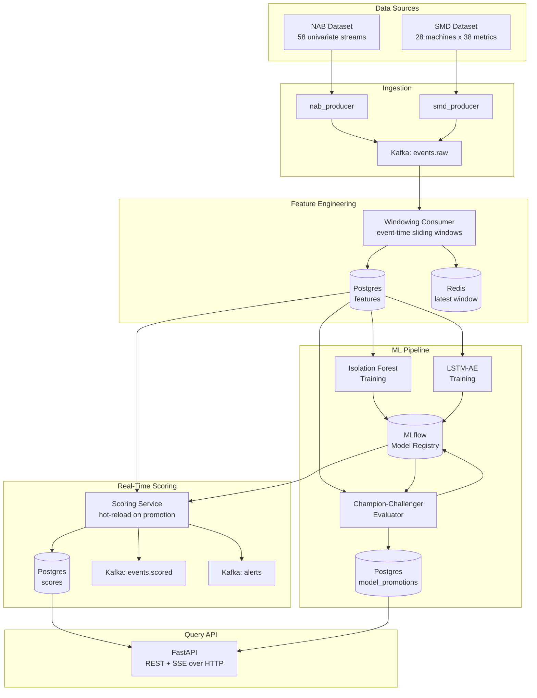
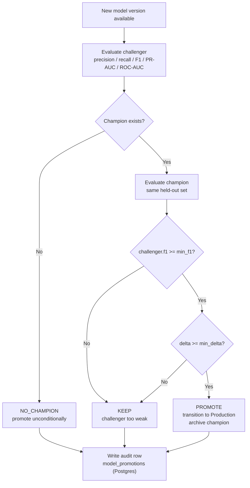
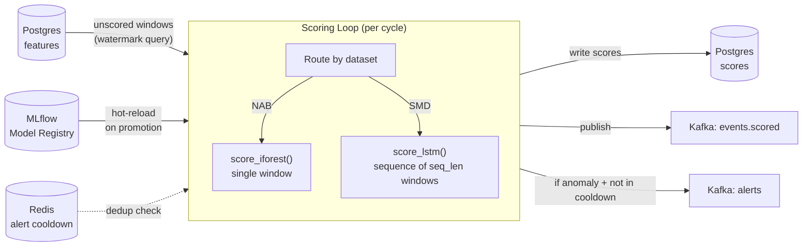

# NeuralSentinel

Real-time anomaly detection and alerting for high-volume sensor and event streams.

---

## System Architecture

The platform is built as a series of decoupled, independently deployable services connected through Kafka and shared Postgres/Redis stores. Each stage has a single, well-defined responsibility.



---

## Infrastructure Overview

The NeuralSentinel infrastructure is modularized using Docker Compose, separating services into distinct compose files linked via a root configuration.

- **Kafka:** Runs in KRaft mode (no ZooKeeper dependency) with a 2-broker data cluster plus a dedicated controller node, designed for production-aligned fault tolerance. The setup splits internal, external, and controller listeners for proper traffic separation. Includes Kafka UI for cluster management.
- **PostgreSQL:** Uses a custom `postgresql.conf` mounted read-only for version-controlled tuning. An initialization script (`init.sql`) automatically creates the `mlflow` database and a least-privilege `nsapp` user. Includes pgAdmin for database administration.
- **Redis:** Configured with persistence (`appendonly yes` and RDB snapshots) to ensure data survives container restarts. Memory is capped at 300MB with an `allkeys-lru` eviction policy, optimized for cache use cases. Includes a Redis UI.
- **MLflow:** Configured with PostgreSQL as the backend store and a local volume for artifact storage.

---

## Folder Structure

```text
.
├── docs
│   ├── Realtime_Anomaly_Detection.md
│   ├── schema.md
│   └── Tickets.md
├── infra
│   ├── conf
│   │   ├── init.sql
│   │   ├── pg_hba.conf
│   │   ├── postgresql.conf
│   │   └── redis.conf
│   ├── docker-compose.yaml
│   ├── kafka-docker-compose.yaml
│   ├── mlflow-docker-compose.yaml
│   ├── postgres-docker-compose.yaml
│   └── redis-docker-compose.yaml
├── config
│   ├── logging.py                # shared setup_logging() - structured JSON handler
│   └── settings.py               # shared pydantic-settings base classes
├── ml
│   ├── training
│   │   ├── features.py           # shared flatten_feature_map() helper
│   │   ├── isolation_forest_config.py
│   │   ├── isolation_forest_data.py
│   │   ├── isolation_forest_train.py
│   │   ├── lstm_config.py
│   │   ├── lstm_data.py
│   │   ├── lstm_model.py
│   │   ├── lstm_train.py
│   │   └── main.py               # unified entrypoint: iforest | lstm-ae
│   └── evaluation                # champion-challenger harness
│       ├── config.py             # EvalConfig (PROMOTE_MIN_F1_SCORE, PROMOTE_MIN_DELTA)
│       ├── evaluator.py          # loads model + calibration, scores held-out set
│       ├── promoter.py           # pure decision function: PROMOTE / KEEP / NO_CHAMPION
│       └── main.py               # orchestrator: find versions, evaluate, transition, audit
├── services
│   ├── common
│   │   └── contracts.py          # EventEnvelope, ScoredEnvelope, AlertEnvelope
│   ├── producer                  # dataset replay -> events.raw
│   │   ├── config.py
│   │   ├── kafka_producer.py
│   │   ├── nab_producer.py
│   │   ├── smd_producer.py
│   │   ├── topic_admin.py
│   │   └── topics.yaml
│   ├── consumer                  # events.raw -> windowed features -> Postgres/Redis
│   │   ├── config.py
│   │   ├── windowing.py          # pure event-time windowing engine
│   │   ├── sinks.py              # Postgres upsert + Redis cache
│   │   ├── main.py               # poll -> window -> persist -> commit loop
│   │   └── schema.sql            # features, model_promotions, scores DDL
│   ├── scorer                    # features -> anomaly scores -> events.scored + alerts
│       ├── config.py             # ScorerConfig (poll interval, batch size, cooldown)
│       ├── model_registry.py     # thread-safe hot-reload from MLflow on promotion
│       ├── scorer.py             # stateless scoring: score_iforest, score_lstm
│       ├── alert_dedup.py        # Redis SET NX EX per-entity cooldown
│       ├── publisher.py          # Kafka producer for events.scored and alerts
│       └── main.py               # watermark-driven polling loop
│   └── api                       # REST + SSE query API for external clients
│       ├── config.py             # APIConfig (host, port, api_key, pagination knobs)
│       ├── auth.py               # X-API-Key header dependency
│       ├── db.py                 # asyncpg pool + typed query functions
│       ├── models.py             # Pydantic response models (public API contract)
│       ├── routes/
│       │   ├── health.py         # GET /healthz (no auth)
│       │   ├── alerts.py         # GET /alerts  GET /alerts/stream (SSE)
│       │   ├── entities.py       # GET /entities/series?entity_id=...
│       │   └── registry.py       # GET /model/current
│       └── main.py               # app factory: lifespan, router mounting, CORS
├── requirements.txt
├── Makefile
└── README.md
```

> The `data/` directory (datasets) and `venv/` are created locally and are gitignored.

---

## Getting Started

The project uses a `Makefile` to manage the full lifecycle. Ensure Docker and Docker Compose are installed before proceeding.

### 1. Environment Setup

Copy `example.env` to `.env` and fill in the required values. Do not commit actual secrets to version control.

### 2. Stack Control

```bash
make up        # start all services in detached mode
make down      # stop and remove containers
make stop      # stop containers without removing them
make start     # start already-created containers
make restart   # down + up
```

---

## Kafka Topics and Event Schema

All events share a single canonical `EventEnvelope` that wraps both dataset shapes - NAB (univariate) and SMD (38-dim multivariate). The full field reference, per-dataset `metrics` structure, and partition-key strategy live in [docs/schema.md](docs/schema.md).

Topics are managed **declaratively**: the desired state lives in [services/producer/topics.yaml](services/producer/topics.yaml), and `topic_admin.py` reconciles the live cluster against it (create missing topics, update configs on existing ones, never silently change partition count).

| Topic | Partitions | RF | Retention | Purpose |
|---|---|---|---|---|
| `events.raw` | 6 | 2 | 72h | Raw dataset rows replayed by the producers |
| `events.scored` | 6 | 2 | 24h | Events annotated with anomaly scores |
| `alerts` | 3 | 2 | 24h | Threshold-crossing anomaly alerts |

> Replication factor is **2** because the cluster runs **2 brokers**. The partition key is `entity_id`, which guarantees per-stream ordering - a hard requirement for the LSTM-AE sequence buffer.

```bash
make topics-sync    # create/update topics from topics.yaml (idempotent)
make topics-list    # list Kafka topics on the cluster
make topics-delete  # delete all declared topics (destructive)
```

---

## Data Pipeline: Dataset Replay Producers

Ingestion replays two real, labeled anomaly datasets into `events.raw` as if they were live telemetry - no synthetic generation. Each dataset row becomes a single `EventEnvelope`, keyed by `entity_id`, and is published to Kafka. Ground-truth labels are preserved on the `is_anomaly` field for downstream evaluation.

| Dataset | Shape | Stream type | Detector path | Label source |
|---|---|---|---|---|
| **NAB** (Numenta Anomaly Benchmark) | Univariate (`value`) | `UNIVARIATE` | Isolation Forest | `combined_labels.json` |
| **SMD** (Server Machine Dataset) | 38-dim (`feature_0..37`) | `MULTIVARIATE` | LSTM Autoencoder | `test_label/` (row-aligned 0/1) |

### Module layout

| File | Responsibility |
|---|---|
| `services/common/contracts.py` | Canonical `EventEnvelope` model - the single source of truth for the on-the-wire message shape, shared by producers and consumers. |
| `kafka_producer.py` | Builds the `confluent_kafka.Producer` from config and publishes each envelope keyed by `entity_id`. Owns delivery semantics (`acks=all`, idempotence, batching, delivery-report callback). |
| `nab_producer.py` | Walks NAB CSVs row-by-row, maps anomaly timestamps onto `is_anomaly`, and replays each stream. |
| `smd_producer.py` | Walks SMD machine files, parses 38-dim rows, attaches row-aligned test labels, and synthesizes a monotonic timestamp per row. |

Keying every message by `entity_id` guarantees per-stream ordering - a hard requirement for the LSTM-AE sequence buffer. All events for one stream land on the same partition and are therefore consumed in order.

### Acquiring the datasets

Both datasets are shallow-cloned into the gitignored `data/` directory. The target is idempotent and skips anything already present:

```bash
make fetch-data
```

Resulting layout (matches the defaults in `config.py`):

```text
data/
├── NAB/data/<category>/<stream>.csv
├── NAB/labels/combined_labels.json
└── SMD/ServerMachineDataset/{train,test,test_label}/<machine>.txt
```

> NAB is licensed AGPL-3.0 and SMD is MIT; neither is redistributed in this repository.

### Running the producers

The stack must be up (`make up`) and the topics created (`make topics-sync`). Each producer accepts a filter env var to replay a single stream for fast local runs:

```bash
# Replay one NAB stream (univariate path)
NAB_STREAM_FILTER=ec2_cpu_utilization_5f5533 venv/bin/python -m services.producer.nab_producer

# Replay one SMD machine (multivariate path)
SMD_MACHINE_FILTER=machine-1-1 venv/bin/python -m services.producer.smd_producer
```

Replay speed is controlled by `NAB_REPLAY_SPEED` / `SMD_REPLAY_SPEED` (`0.0` = max throughput; larger values throttle each row). Omitting the filter replays all 58 NAB streams / 28 SMD machines.

---

## Feature Windowing Consumer

The consumer reads raw events from `events.raw`, groups them per `entity_id`, computes rolling-window features over **event time**, and persists each window to Postgres (offline training store) while caching the latest window per entity in Redis (online scoring cache).

Event time - not wall-clock - is the time axis. The producers replay at max throughput, so an entire stream arrives in seconds; windows are cut on each event's own `timestamp`, which makes the feature output identical regardless of replay speed.

### What is windowing?

A **window** is a fixed slice of time over one stream. Each window has two parameters: a **size** (how wide the slice is) and a **slide** (how far time advances before the next window starts). When `slide == size` the windows are **tumbling** - back-to-back, non-overlapping. When `slide < size` they **slide** - overlapping, which scores more often and reacts faster at the cost of more rows.

```text
stream of events (one entity, ordered by event-time):
  . . .  . . . . .   . .  . . . .  . .   >> (keeps arriving)
  |-- window 1 ---|  |-- window 2 ---|  |-- window 3 ---|
        |                   |                   |
        v                   v                   v
  one feature row     one feature row     one feature row
  (mean, std,         (mean, std,         (mean, std,
   min, max,           min, max,           min, max,
   slope, count)       slope, count)       slope, count)
```

Boundaries are driven by **data, not the clock**. Each entity keeps its own buffer. As events arrive, their event-time acts as a watermark: when it crosses a window boundary, every window up to that point is emitted and old events are evicted. On shutdown, the trailing partial window is flushed so nothing is silently dropped.

**The features per window** (computed in `windowing.py`, no I/O):

| Feature | What it captures |
|---|---|
| `mean` | The window's baseline level. |
| `std` | Volatility / spread - population standard deviation. |
| `min` / `max` | The extremes reached in the window. |
| `slope` | Direction and rate of change `(last - first) / span`. |
| `event_count` | How many raw events backed this window (density / confidence). |

For SMD's 38 dimensions these are computed **per metric**, so the feature row is a map of `{metric: {mean, std, ...}}` rather than a flat set of numbers.

### Module layout

| File | Responsibility |
|---|---|
| `config.py` | `ConsumerConfig` - Kafka, window sizing, Postgres DSN, Redis, batching knobs, all overridable via `.env`. |
| `schema.sql` | `features`, `model_promotions`, and `scores` table DDL. All `CREATE ... IF NOT EXISTS` - safe to re-run. |
| `windowing.py` | Pure, I/O-free windowing engine. Per-entity buffers, epoch-aligned sliding windows, feature computation. Unit-testable in isolation. |
| `sinks.py` | `FeatureSink` - batched `INSERT ... ON CONFLICT DO NOTHING` into Postgres plus a best-effort Redis cache of the latest window per entity. |
| `main.py` | The poll -> window -> persist -> commit loop. Manual offset commits happen **after** a durable write, and SIGINT drains trailing windows before exit. |

### Delivery semantics

Writes are **persist-before-commit**: a batch is written to Postgres before its Kafka offsets are committed. A crash between the two replays the batch, and the `(entity_id, window_end)` primary key dedups it via `ON CONFLICT DO NOTHING`. The result is at-least-once delivery plus idempotent writes - effectively-once features.

### Window labels

Each window carries a three-state `label`:

| Value | Meaning |
|---|---|
| `true` | The window contains at least one ground-truth anomaly. |
| `false` | The window is known-normal (all events labeled normal). |
| `null` | Unlabeled (e.g. the SMD train split) - deliberately preserved, not collapsed to `false`. |

### Running the consumer

```bash
make migrate        # apply feature-store schema (idempotent)
make consume        # start the consumer; Ctrl-C drains and exits cleanly
```

Then drive data through it from another shell:

```bash
make produce-nab    # and/or: make produce-smd
```

Query the resulting feature store:

```sql
SELECT dataset, stream_type, count(*) FROM features GROUP BY 1, 2;
SELECT entity_id, window_start, window_end, event_count, features
FROM features ORDER BY window_end DESC LIMIT 5;
```

The latest window per entity is also cached in Redis under `features:latest:<entity_id>` as a JSON blob.

---

## ML Training

Both detectors train on windowed features persisted by the consumer. The stack must be up and features must be loaded before running either job.

### Isolation Forest (`neural-sentinel-isolation-forest-model`)

An `IsolationForest` from scikit-learn is the first-stage detector, trained on the NAB UNIVARIATE path. Isolation Forest works by randomly partitioning the feature space into binary trees; points that are isolated quickly (short average path length) are anomalous - no notion of a "normal" cluster shape is assumed.

**Training choices:**

- Trained on **known-normal rows only** (`label == false`). Anomaly rows are excluded from the fit so the model learns only the normal distribution and flags deviations from it.
- **Warm-start incremental fitting** (20 checkpoints up to `N_ESTIMATORS=300` trees) with per-step progress logs.
- **Time-ordered train/val split** (80/20). Validation rows come from later in time so the model is never evaluated on data from its own training window.
- **Threshold from the validation quantile:** `np.quantile(val_scores, CONTAMINATION)` on `score_samples` output. Lower score = more anomalous.

**Validation results (NAB - 143,284 windows - 5 features):**

| Metric | Value |
|---|---|
| `valid_roc_auc` | 0.909 |
| `valid_pr_auc` | 0.011 |
| `valid_recall` | 0.381 |
| `threshold (score_samples @ q=0.05)` | -0.390295 |

> PR-AUC is low (~0.011) because the NAB anomaly rate is ~0.5% - precision is extremely sensitive to the threshold at this imbalance. ROC-AUC of 0.909 shows the model has strong ranking ability regardless.

```bash
make train-iforest
```

Results are visible in the MLflow UI at http://localhost:58083 under the `neural-sentinel-isolation-forest` experiment. Registered model: `neural-sentinel-isolation-forest-model`.

### LSTM Autoencoder (`neural-sentinel-lstm-autoencoder-model`)

An LSTM-based sequence autoencoder is the second-stage detector, trained on the SMD MULTIVARIATE path (28 machines x 38 metrics). Where the Isolation Forest scores individual feature vectors, the LSTM-AE scores sequences - it learns to reconstruct normal temporal patterns and flags windows where reconstruction error is high.

**Architecture:**

```
Input  (batch, T=30, F=190)
  |
  v
Encoder LSTM  (n_layers=2, hidden_dim=64)
  |  bottleneck: final hidden + cell state (h_n, c_n)
  v
context = h_n[-1] repeated T times  ->  (batch, 30, 64)
  |
  v
Decoder LSTM  (n_layers=2, hidden_dim=64)
  |
  v
Linear projection  ->  (batch, 30, 190)   <- reconstruction
  |
  v
Anomaly score = mean( (input - reconstruction)^2 ) per sequence
```

The decoder receives the same bottleneck vector at every timestep as input - not its own previous output. This prevents the decoder from copying the input step-by-step and forces it to reconstruct purely from the compressed latent representation. A sequence the model has never seen cannot be compressed well, so reconstruction error is high.

**Training choices:**

- Sequences are built per entity with the train/val split applied before windowing - sequences never cross machine boundaries, and no future timestep leaks into training sequences.
- Trained on normal sequences only (same philosophy as IForest).
- Early stopping (`patience=5`) with best-checkpoint restore - the weights with the lowest validation loss are kept, not the final epoch's weights.
- Threshold: `np.quantile(val_errors, 1 - CONTAMINATION)` - the top `CONTAMINATION` fraction of validation reconstruction errors. Note the direction is opposite to IForest: high error = anomalous.
- Model exported as TorchScript (`torch.jit.trace`) before registration. The scoring service can load it without importing the model class definition.

**Validation results (SMD - 36,976 train sequences - 8,644 val sequences - 190 features):**

| Metric | Value |
|---|---|
| `val_best_loss` (MSE) | 0.6716 |
| `threshold (recon_error @ q=0.95)` | 2.755 |
| `val_predicted_anomaly_rate` | 0.050 |
| Epochs trained | 28 / 50 (early stop) |

```bash
make train-lstm-ae
```

Results are visible in the MLflow UI at http://localhost:58083 under the `neural-sentinel-lstm-autoencoder` experiment. Registered model: `neural-sentinel-lstm-autoencoder-model`.

---

## Champion-Challenger Evaluation and Model Promotion

After training, a dedicated evaluation harness compares the **challenger** (newest version) against the current **champion** (Production stage) on a held-out labeled validation set. If the challenger beats the champion by a configured margin it is automatically transitioned to Production in the MLflow registry and the old version is archived.

### Decision flow



**Decision rules** (configured in `.env`):

| Condition | Decision |
|---|---|
| No champion exists yet | `NO_CHAMPION` - promote unconditionally |
| `challenger.f1 < PROMOTE_MIN_F1_SCORE` | `KEEP` - challenger is too weak regardless of delta |
| `challenger.f1 - champion.f1 >= PROMOTE_MIN_DELTA` | `PROMOTE` |
| Otherwise | `KEEP` |

### Module layout

| File | Responsibility |
|---|---|
| `ml/evaluation/config.py` | `EvalConfig` - inherits Postgres + MLflow settings; exposes `PROMOTE_MIN_F1_SCORE`, `PROMOTE_MIN_DELTA`, `EVAL_VALIDATION_RATIO`. |
| `ml/evaluation/evaluator.py` | Loads model + calibration artifact from MLflow, queries windowed features from Postgres, returns `EvalResult`. |
| `ml/evaluation/promoter.py` | Pure, I/O-free decision function. `decide(challenger, champion, min_f1, min_delta)` returns a `PromotionVerdict`. |
| `ml/evaluation/main.py` | Orchestrator: find Staging/latest version, evaluate, call promoter, MLflow stage transition, write audit log. |

### Audit log

Every evaluation writes one row to the `model_promotions` table:

```sql
SELECT model_name, challenger_version, champion_version, decision, reason, promoted_at
FROM model_promotions ORDER BY id;
```

### Running evaluation

```bash
make evaluate-iforest   # evaluate neural-sentinel-isolation-forest-model
make evaluate-lstm      # evaluate neural-sentinel-lstm-autoencoder-model
```

First run (no Production version) produces a `NO_CHAMPION` decision and promotes the challenger automatically. Subsequent runs compare the latest version against the incumbent.

### Config knobs

| Variable | Default | Meaning |
|---|---|---|
| `PROMOTE_MIN_F1_SCORE` | `0.0` | Minimum absolute F1 the challenger must reach |
| `PROMOTE_MIN_DELTA` | `0.01` | Minimum F1 improvement over champion to trigger promotion |
| `EVAL_VALIDATION_RATIO` | `0.2` | Fraction of the feature store used as the held-out eval set |

---

## Real-Time Anomaly Scoring Service

The scoring service is the operational core of the platform. It polls Postgres for feature windows that have not yet been scored, runs each window through the current Production model, writes results to the `scores` table, and publishes `ScoredEnvelopes` to `events.scored`. Any window whose score crosses the anomaly threshold is additionally deduplicated via Redis and published to the `alerts` topic.

### How scoring works



### Dataset to model routing

| Dataset | Model | Scoring logic |
|---|---|---|
| NAB (UNIVARIATE) | `neural-sentinel-isolation-forest-model` | Single window: `score_samples` vs calibrated threshold. Lower = more anomalous. |
| SMD (MULTIVARIATE) | `neural-sentinel-lstm-autoencoder-model` | Sequence of last `seq_len` windows: reconstruction MSE vs calibrated threshold. Higher = more anomalous. If fewer than `seq_len` windows exist for an entity, the sequence is left-padded with zeros. |

### Hot-reload on model promotion

`ModelRegistry.refresh()` is called every N poll cycles. It checks MLflow for the current Production version per model name. If the version has changed since the last check, the new model and calibration artifact are loaded and atomically swapped into the in-memory slot - zero-downtime, no process restart required. The worst-case lag between a promotion and the scorer picking up the new model is `poll_interval_s x model_refresh_cycles` (default: approximately 60 seconds).

### Alert deduplication

A per-(model, entity) Redis key with a TTL prevents alert storms when a stream remains anomalous across consecutive windows. The key is set with a single atomic `SET NX EX` command so there is no race condition even with multiple concurrent scorer replicas.

### Delivery semantics

The `scores` table in Postgres is the durable record. DB writes commit before Kafka produces. A crash between the commit and the Kafka produce will replay the scoring cycle on restart - the `(entity_id, window_end, model_name)` primary key makes the DB write idempotent, and only the Kafka publish is re-sent.

### Module layout

| File | Responsibility |
|---|---|
| `config.py` | `ScorerConfig` - poll interval, batch size, model refresh cadence, alert cooldown, all overridable via `.env`. |
| `model_registry.py` | `ModelRegistry` - thread-safe, hot-reloadable wrapper around MLflow. Maintains one `LoadedModel` per registered model name. |
| `scorer.py` | Stateless scoring functions: `score_iforest` (single window) and `score_lstm` (sequence with left-zero-padding). No I/O. |
| `alert_dedup.py` | `AlertDedup` - Redis `SET NX EX` based cooldown. Fails open on Redis errors (better to over-alert than silently suppress). |
| `publisher.py` | `ScoringPublisher` - idempotent Kafka producer for `events.scored` and `alerts`. Flushes on shutdown. |
| `main.py` | Watermark-driven polling loop with cooperative SIGINT/SIGTERM shutdown. |

### Running the scoring service

The stack must be up, features must exist in Postgres, and at least one Production model must be promoted before starting:

```bash
make migrate        # ensure scores table exists (idempotent)
make score          # start the scoring service; Ctrl-C triggers clean shutdown
```

Query the scores table:

```sql
-- Overall scoring summary
SELECT model_name, count(*) AS scored, sum(is_anomaly::int) AS anomalies
FROM scores GROUP BY model_name;

-- Recent anomalies
SELECT entity_id, window_end, model_name, anomaly_score, scored_at
FROM scores
WHERE is_anomaly = true
ORDER BY scored_at DESC LIMIT 20;
```

### Config knobs

| Variable | Default | Meaning |
|---|---|---|
| `SCORER_POLL_INTERVAL_S` | `5.0` | Sleep between poll cycles when no unscored windows are found |
| `SCORER_BATCH_SIZE` | `100` | Max windows to fetch and score per poll cycle |
| `SCORER_MODEL_REFRESH_CYCLES` | `12` | Check MLflow for version changes every N cycles |
| `ALERT_COOLDOWN_S` | `300` | Per-entity alert suppression window in seconds |

---

## Query API

The query API is an HTTP service that exposes scored anomaly data to dashboards, downstream pipelines, and operators. It reads from the `scores` and `model_promotions` tables and streams new alerts to connected clients via Server-Sent Events.

Interactive documentation is available at `http://localhost:8000/docs` (Swagger UI) when the service is running.

### Authentication

All endpoints except `/healthz` require an `X-API-Key` header. The key is a shared secret configured via `API_KEY` in `.env`. This is a service-to-service secret - do not embed it in client-side code.

```bash
curl -H "X-API-Key: <your-key>" http://localhost:8000/alerts
```

### Endpoints

| Method | Path | Auth | Description |
|---|---|---|---|
| `GET` | `/healthz` | None | DB liveness probe. Returns `{"status":"ok","db":"ok"}`. |
| `GET` | `/alerts` | Required | Paginated list of anomalous score rows, newest first. |
| `GET` | `/alerts/stream` | Required | SSE stream of new alerts. Long-lived connection; each event is a JSON `ScoreRow`. |
| `GET` | `/entities/series` | Required | All score rows (anomalous and normal) for one entity, newest first. |
| `GET` | `/model/current` | Required | Currently promoted Production model versions. |

### Pagination

List endpoints (`/alerts`, `/entities/series`) use **cursor-based pagination** on `scored_at`. The response includes a `next_cursor` field - pass it as the `before` query parameter to fetch the next page. When `next_cursor` is `null` there are no more pages.

```bash
# First page
curl -H "X-API-Key: <key>" "http://localhost:8000/alerts?limit=20"

# Next page (use next_cursor from previous response)
curl -H "X-API-Key: <key>" "http://localhost:8000/alerts?before=2026-06-27T19:00:00Z&limit=20"
```

### SSE stream

Each event is a JSON-encoded score row pushed as soon as a new anomaly is written to the `scores` table. The server polls every `SSE_POLL_INTERVAL_S` seconds. Reconnection on drop is handled automatically by the browser's `EventSource` API.

```bash
# Keep-alive stream; events appear as anomalies are scored
curl -N -H "X-API-Key: <key>" http://localhost:8000/alerts/stream
```

### Entity series

Entity IDs can contain `/` (e.g. `NAB/realAdExchange/exchange-2_cpc_results`). Pass the full ID as a query parameter - do not URL-encode the slashes.

```bash
curl -H "X-API-Key: <key>" \
  "http://localhost:8000/entities/series?entity_id=NAB/realAdExchange/exchange-2_cpc_results"
```

### Running the API

```bash
make serve    # starts on 0.0.0.0:8000; Ctrl-C to stop
```

### Config knobs

| Variable | Default | Meaning |
|---|---|---|
| `API_KEY` | (required) | Shared secret for `X-API-Key` header authentication |
| `API_HOST` | `0.0.0.0` | Bind address |
| `API_PORT` | `8000` | Listen port |
| `API_DEFAULT_PAGE_SIZE` | `50` | Default items per page when `limit` is not specified |
| `API_MAX_PAGE_SIZE` | `500` | Maximum `limit` a client can request |
| `SSE_POLL_INTERVAL_S` | `2.0` | How often the SSE generator polls Postgres for new alerts |
