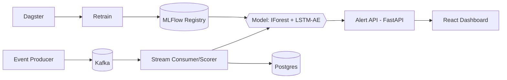

# Project 01 — Real-Time Anomaly Detection Platform

> Build order: **1** (Phase 1) · Primary ML-pivot signal · Source theme: Prompt 02 / Project 1

## Tagline
Stream event/sensor data, detect anomalies in real time, and serve alerts to operators — mirrors production lag/anomaly work.

## Seniority Signal
Streaming ingestion at volume, online inference latency budget, automated retraining loop, model registry promotion.

## Tech Stack
Kafka · Isolation Forest + LSTM Autoencoder (PyTorch/sklearn) · FastAPI · React (Recharts/D3) · MLFlow · Dagster (retraining) · PostgreSQL/Redis · Docker Compose.

## Architecture (sketch)

## Scope Skeleton (expand to full 15-ticket contract when starting)
- Epic A: Infra + Kafka topics + Docker Compose
- Epic B: Synthetic event generator + ingestion
- Epic C: Model training (IForest, LSTM-AE) + MLFlow tracking
- Epic D: Real-time scoring consumer + alert API
- Epic E: React dashboard + live anomaly view
- Epic F: Dagster retraining + champion-challenger promotion
- Epic G: Tests + observability + README

## Open-Source Datasets (pick 1 primary + synthetic)

| Dataset | What it is / size | License | Use it for | How to get |
|---|---|---|---|---|
| **NAB** (Numenta Anomaly Benchmark) | 58 labeled real + artificial time-series streams (CPU, traffic, sensors), ~50 MB | AGPL-3.0 | Primary demo: labeled streaming anomalies with ground truth | `git clone https://github.com/numenta/NAB` |
| **SMD** (Server Machine Dataset) | 28 multivariate server-metric machines, labeled anomalies | MIT | Multivariate LSTM-Autoencoder training (closest to infra metrics) | `git clone https://github.com/NetManAIOps/OmniAnomaly` (data under `ServerMachineDataset/`) |
| **SKAB** (Skoltech Anomaly Benchmark) | 35 multivariate sensor CSVs with labels | MIT | Alternative multivariate benchmark, easy CSV format | `git clone https://github.com/waico/SKAB` |
| **NSL-KDD** | Network intrusion records, ~150K rows | Open (research) | Tabular anomaly variant / Isolation Forest demo | Kaggle: `kaggle datasets download hassan06/nslkdd` |
| **Built-in synthetic generator** | You generate it (sine + drift + spikes) | Yours | Fully reproducible demo with no download or license worry | Code in Epic B |

> **Recommended:** NAB for the labeled live demo + your synthetic generator for reproducibility. Add SMD if you want a meatier multivariate LSTM-AE story.

## How to Pursue Them (workflow)
1. **Get Kaggle API** once: create token at kaggle.com → `~/.kaggle/kaggle.json`, `chmod 600`. (Never commit it.)
2. **Clone/download** into `data/` (gitignored). For NAB: each stream is a CSV with `timestamp,value`; labels live in `labels/combined_labels.json`.
3. **Explore** in a notebook: plot a few streams, mark labeled anomaly windows, decide window size + features (rolling mean/std, diff, EWMA).
4. **Replay as a stream:** your producer reads the CSV row-by-row and publishes to Kafka with a small sleep, simulating live telemetry.
5. **Train offline** on the non-anomalous portion (IsolationForest, LSTM-AE), log to MLflow, register, then the consumer scores the replayed stream.
6. **Evaluate** against NAB labels (precision/recall, NAB score) and tune the alert threshold toward precision to avoid alert storms.

## Full Tool Stack (all free / local)
- **Ingestion/stream:** Apache Kafka (Docker), synthetic producer (Python).
- **Processing/scoring:** Python consumer (or Spark Structured Streaming if you scale).
- **Models:** scikit-learn Isolation Forest, PyTorch LSTM-Autoencoder.
- **Experiments + registry:** MLflow (local server in Compose).
- **Retraining orchestration:** Dagster.
- **Stores:** PostgreSQL (events/scores) + Redis (latest state).
- **API:** FastAPI. **Frontend:** React + Recharts/D3.
- **Infra:** Docker Compose. **Observability:** Prometheus + Grafana (optional).

## Free Deployment Map
| Component | Free host | Notes |
|---|---|---|
| Scoring/alert API (FastAPI) | Hugging Face Spaces (Docker) or Google Cloud Run | Cloud Run scales to zero; HF Spaces easiest |
| Dashboard (React) | Vercel | Free static/SSR hosting |
| Database | Neon Postgres (free) | Serverless Postgres |
| Redis | Upstash (free) | Serverless Redis |
| Kafka + streaming | **Run locally**, record a demo GIF/video | Managed Kafka isn't free long-term; document arch + show the local pipeline |
| Model training | Kaggle / Colab free GPU | Export weights, load in the service |

> **Deploy strategy:** ship the *inference slice* (API + dashboard + DB) publicly for the portfolio link; keep the full Kafka pipeline local and show it via README diagram + recorded demo.

## Definition of Done
End-to-end alerting demo; retraining promotes best model automatically; README complete; **live demo link added to portfolio.**
